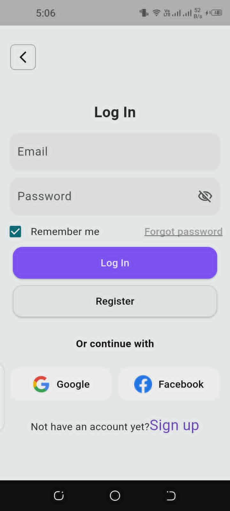
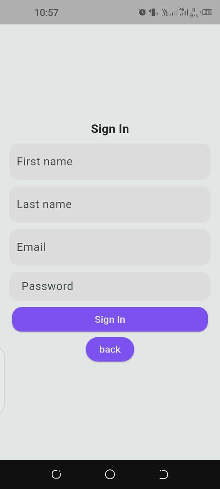
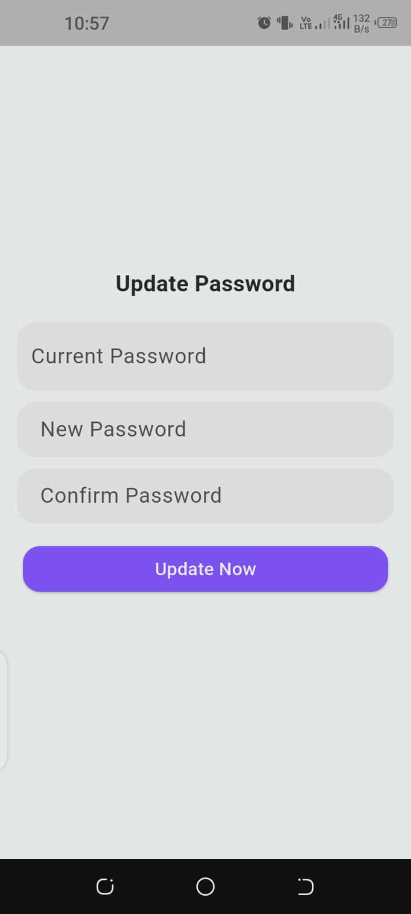
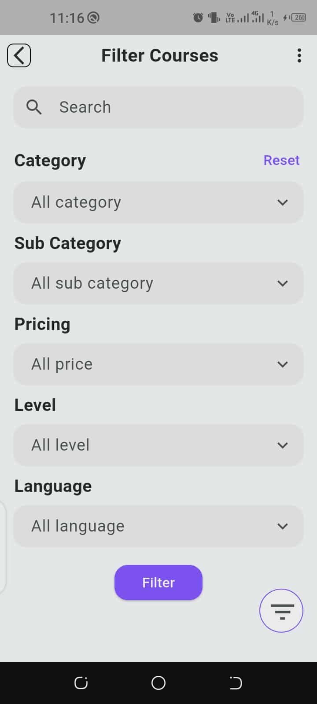
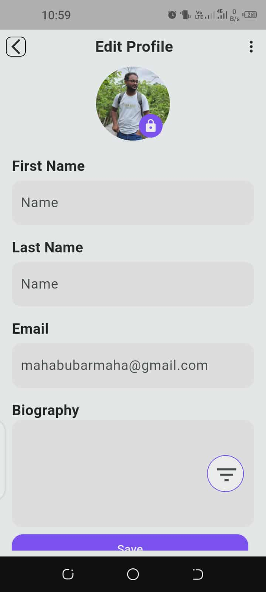

# 📚 My Courses

A Flutter UI project showing different course-related pages and user account screens.

---

## 📸 Screenshots
-Login
-Sign In

| Login | Sign In | Update Password |
|-------|----------|-----------------|
|  |  |  |

| My Courses | Wishlist | Courses |
|-------------|-----------|----------|
|  |  |  |

| Account | Filter Courses | Edit Profile |
|----------|----------------|---------------|
|  |  |  |

| Course |

|  |

---

## ⚙️ Run the Project

```bash
flutter pub get
flutter run

